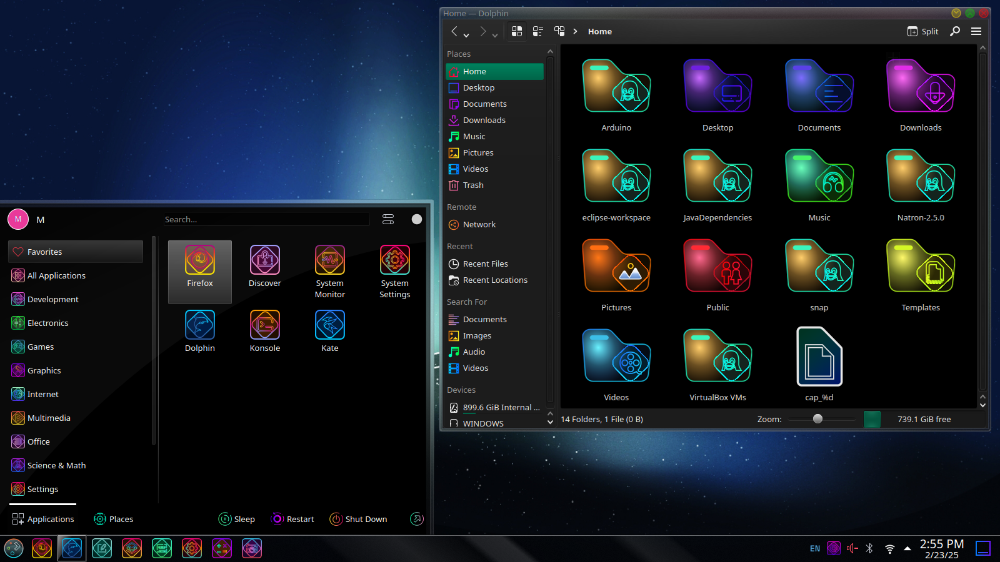

>Dark mode icon theme derived from EliverLara's [Candy-Icons](https://github.com/EliverLara/candy-icons) and L4ki's [Azure-Glassy-Dark-Icons](https://github.com/L4ki/Azure-Plasma-Themes).

## For GNOME

### Installation
Run `cd ~/.icons && git clone https://github.com/Delphindae99/Neon-Dreamscape` to download files. (If ~/.icons/ does not exist, create it.) The GitHub .ZIP files do not preserve symlinks, so you must use `git clone`.

To set icon theme, run:

`gsettings set.org.gnome.desktop.interface icon-theme Neon-Dreamscape`

in a terminal or install GNOME Tweaks with `sudo apt install gnome-tweaks` and change it under the "appearances" tab.

Note that you may need to manually update this icon set due to using manual git. If you have a GitHub account, you can watch and star the original repository for updates and run `git pull` in the icon root directory.
### Status Icons
The icons in the "Status" folder are designed for KDE Plasma. On GNOME, the status icons will be from whatever theme is listed under "Inherits" in `index.theme`. Currently, it is listed as Yaru and Adwaita. If neither of these is present or appealing, simply add the name of the desired icon theme at any point in the list prior to "Yaru".

## For KDE Plasma

### Installation
Run `cd ~/.local/share/icons && git clone https://github.com/Delphindae99/Neon-Dreamscape` to download files. (If ~/.local/share/icons/ does not exist, create it.) The GitHub .ZIP files do not preserve symlinks, so you must use `git clone`.
The theme should now be available under "Appearance" in Plasma system settings.

Note that you may need to manually update this icon set due to using manual git. If you have a GitHub account, you can watch and star the original repository for updates and run `git pull` in the icon root directory.

### Dolphin File Manager
In some cases, by default, Dolphin's icon will display as a purple file folder. This is because the icon, as is at install, is `system-file-manager`. For those who would like the blue dolphin icon pictured above, run

`sudo nano /usr/share/applications/org.kde.dolphin.desktop`

and replace `system-file-manager` with `org.kde.dolphin`. This should hold until Plasma and/or Dolphin are updated, at which point make the switch again.

## Missing Icon Requests
If you see an icon that is not included:
In the case that you are using Ubuntu or a derivative, first ensure that the target application is not a snap. Snap-installed applications do not accept custom icon themes. Also check the desktop file in `/usr/share/applications/` to ensure the icon is not hardlinked in that file. (Slack, for example, is like this.) If it is, the only fix is to use `nano` to change the icon file name to the name of the icon file listed in the theme. This will change when the program updates again. The only way to maintain this is to continue editing its desktop file. I have no control over these files. I apologize.

In the case that the icon is truly missing, submit a GitHub issue with the header "Icon Request". Include the name of the application, its purpose (to ensure that I can find the correct icon), and the filename of its icon (which can usually be found in its desktop file in `usr/share/applications`). I will try to fix the issue as soon as possible.
